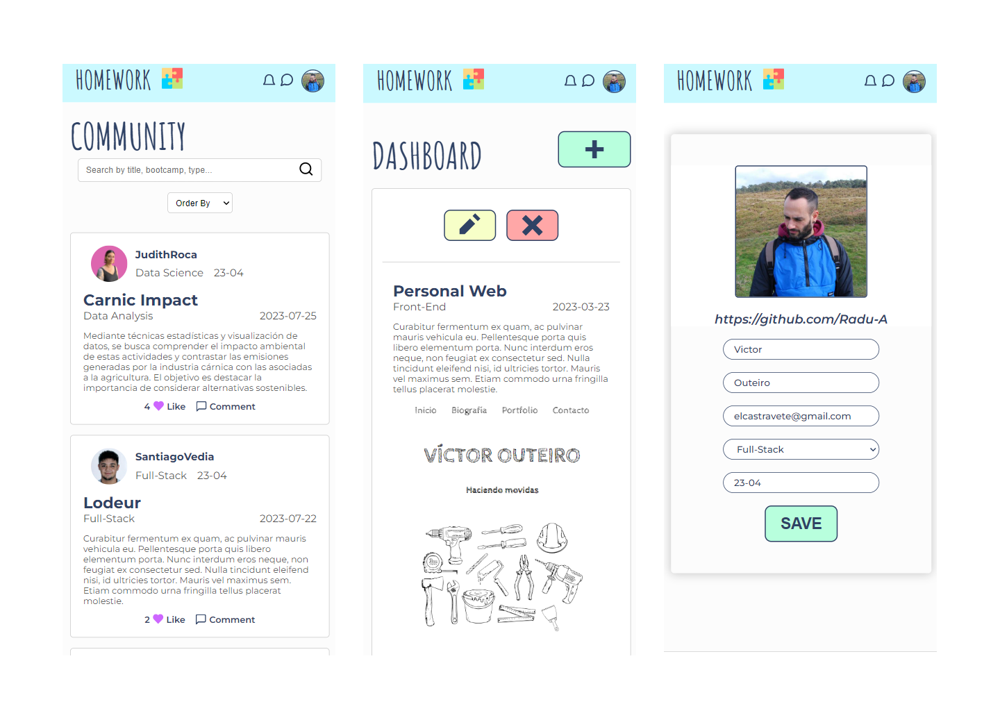
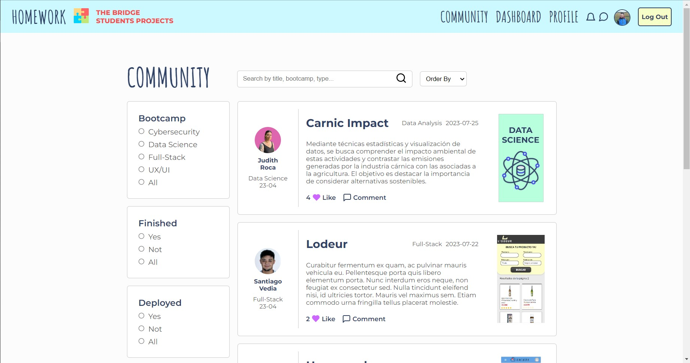
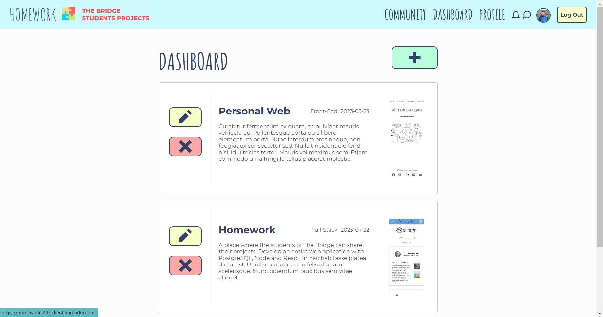
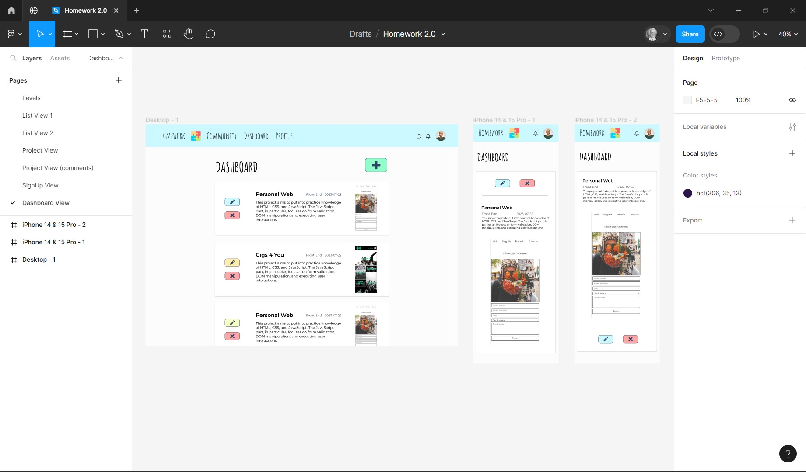
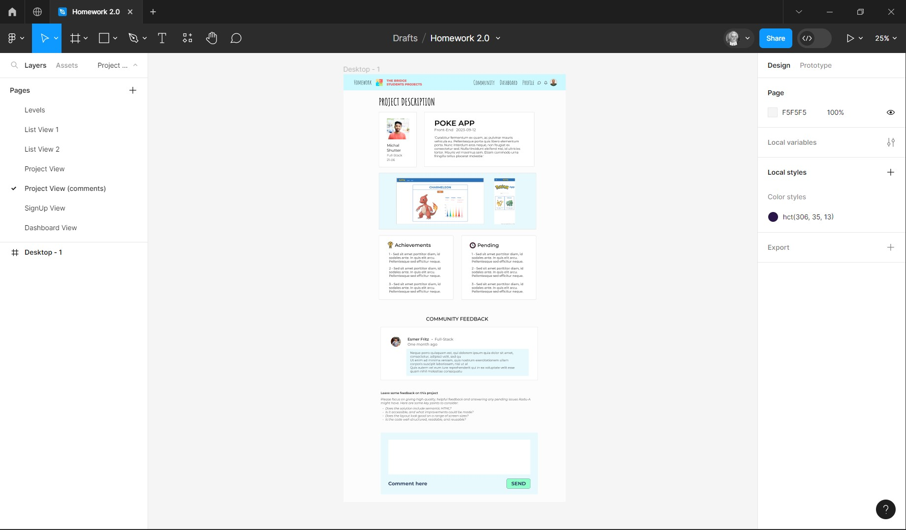

# Homework

A web site where the students of The Bridge can upload their projects to show what they have achieved or what have left to do.

<a href="https://homework-2-0-client.onrender.com/" class="live-site">Live site</a>

<!-- <a href="https://homework-2-0-client.onrender.com/" class="live-site">Homework</a> -->

## Table of contents

- [Overview](#overview)
  - [Description](#description)
  - [Screenshots](#screenshots)
- [My process](#my-process)
  - [Built with](#built-with)
  - [Useful resources](#useful-resources)
- [Acknowledgments](#acknowledgments)

## Overview

### Description

- Home: You can search and navigate throw the projects. If you click on the name of a directory you can see his details
- Sign un / Log in: Try to sign in usign your github account. Once you have been logged in you could visit your Dashboard and your Profile
- Dashboard: The view where you can upload, edit or delete your projects.
- Profile: The place where you can update your data.

### Screenshots

<!--  -->
<!-- 
 -->

   
   
   

## My process

### Designed with figma

   
   

### Built with

- PostgreSQL
- Node Express
- Semantic HTML5 markup
- SASS custom properties
- Flexbox
- Mobile-first workflow
- [React](https://reactjs.org/) - JS library
- [Material UI](https://mui.com/) - For styles
- [Auth0](https://auth0.com/) - Authentication service
- [Render](https://render.com/) - Deployment and hosting service
- [ElephantSQL](https://www.elephantsql.com/) - PostgreSQL hosting service

### Key points

Back-end

- Data model design with Entity-Relationship Diagram
- Create and deploy a PostgreSQL Data Base
- Construct the CRUD with Node and PostgreSQL
- Routing with Node and Express
- Search engine based on SQL queries

Front-end

- Build the React components structure
- Functionality with React states and lifecycle of their components
- Implement Hooks to enlarge the potential of the App
- Routing with React Router Dom
- Styles with SASS
- MUI components

### Useful resources

- [React documentation](https://es.react.dev/learn) - This is an amazing documentation that guides you to get used with the way that React works.
- [react-hook-form documentation](https://react-hook-form.com/get-started) - This documentation is also great and show you step by step how to implement this hook to your project.

## Acknowledgments

Thanks a million to my teacher Alejandro Reyes and his teacher assistances Guillermo Rubio and Javier Espinosa. I can do all this stuff because of them.